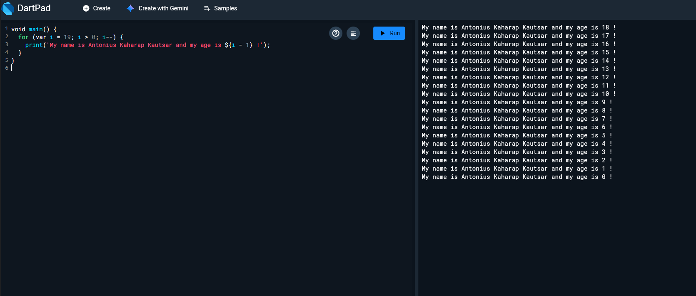
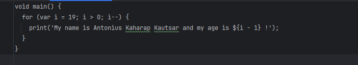

Name: Antonius Kaharap Kautsar
Class: TI-3I
NIM: 2341720067

**Soal 1  Modifikasilah kode pada baris 3 di VS Code atau Editor Code favorit Anda berikut ini agar mendapatkan keluaran (output) sesuai yang diminta!Output yang diminta (Gantilah Fulan dengan nama Anda):**
 
**Soal 2 Mengapa sangat penting untuk memahami bahasa pemrograman Dart sebelum kita menggunakan framework Flutter ? Jelaskan!**
 
**Soal 3 Rangkumlah materi dari codelab ini menjadi poin-poin penting yang dapat Anda gunakan untuk membantu proses pengembangan aplikasi mobile menggunakan framework Flutter.**

**Soal 4 Buatlah penjelasan dan contoh eksekusi kode tentang perbedaan Null Safety dan Late variabel !**
**Kumpulkan jawaban Anda kepada dosen pengampu sesuai kesepakatan di kelas.**

# Answer

1. The Code and output are in the following: 
/img
/src
   . The code runs a loop starting from 19 down to 1, each time printing your name and age as i - 1. That’s why it shows ages from 18 down to 0.
2. It is important to understand Dart because Flutter is built using Dart. Knowing Dart helps us write code, fix errors, and understand how Flutter works. Without Dart basics, Flutter will feel confusing.
3. Dart is the programming language used in Flutter. It combines modern features such as garbage collection, optional type annotations, type safety, and portability across platforms. Dart can run with JIT (Just-In-Time) compilation for fast testing and hot reload during development, or with AOT (Ahead-Of-Time) compilation for better performance in production. Originally built for the web, Dart is now focused on mobile development and cross-platform apps. Its syntax is similar to C or JavaScript, making it easier to learn for beginners with prior coding experience. Dart also supports object-oriented programming with classes, inheritance, and polymorphism, which helps organize code clearly. Operators, control flow, and functions work like in most modern languages, so adapting is simple. Tools such as DartPad allow beginners to experiment online without setup, making it very practical for practice. Understanding Dart well is essential because all Flutter code, plugins, and dependencies are built using Dart.
4. Null Safety: makes sure variables cannot be null unless we allow them.
i.e String name = "Alex"; // cannot be null
Late Variable: we tell Dart the variable will get a value later.
i.e late String message; message = "Hello!";
